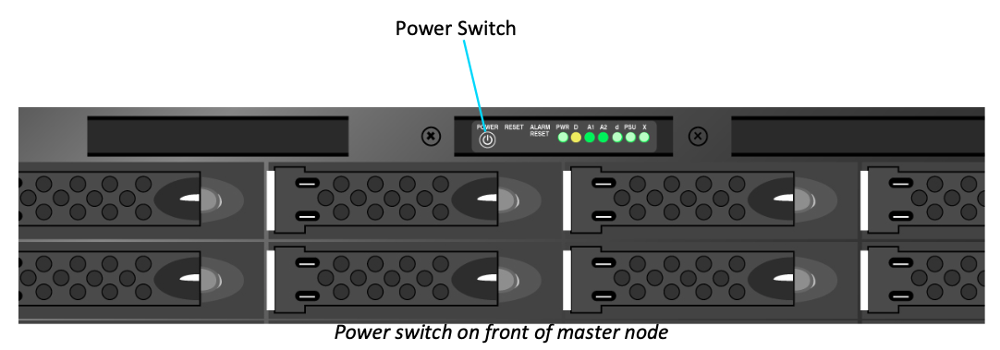

# Starting up the system

Baselight TWO and Baselight X systems consist of a master node \(which is normally installed in a rack in a machine room somewhere\) and a small, desktop ‘UI host’ PC which will probably be on or close to the desk where you are working. To power up the system you will first need to go to the machine room and turn on the master node by pressing the small switch above the disk array:

Once the master node has finished booting it will send a signal to the UI host via the Ethernet link which in turn will cause the UI host PC to wake up and boot – you don’t normally need to turn on the UI host PC manually, it should happen automatically. This whole process can take several minutes, and until it is complete you may not see anything displayed on the Baselight monitors so please be patient.

Systems which are based on a Z8 or Z840 HP workstation \(e.g. Baselight ONE and Baselight ASSIST\) are powered on using the button on the front of the workstation:

